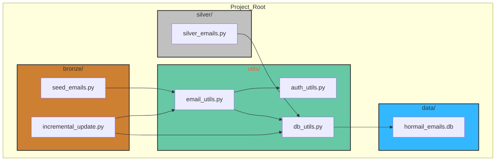
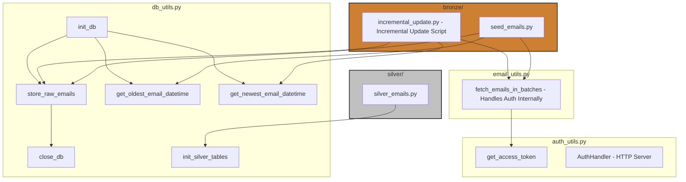

# Table of Contents
1. [Folder Structure](#folder-structure)
2. [File Architecture](#file-architecture)
3. [Bronze Software Architecture](#bronze-software-architecture)

<br>
<hr>


# System Architecture

```mermaid
graph TD;
    
    subgraph Application [Hotmail Assistant]
        style Application fill:#333333,stroke:#3ff,stroke-width:2px
        A1[Email Fetching & Processing] --> A2[Bronze Layer - Raw Emails Storage]
        A2 --> A3[Silver Layer - Transformed Emails Storage]
    end
    
    subgraph SQLite [SQLite Database]
        style SQLite fill:#A131C1,stroke:#333,stroke-width:2px
        DB1[bronze_emails - Raw Data] --> DB2[silver_emails - Transformed Data]
    end
    
    subgraph MicrosoftGraph [Microsoft Graph APIs]
        style MicrosoftGraph fill:#3333FF,stroke:#333,stroke-width:2px
        MG1[Authenticate with OAuth] --> MG2[Fetch Emails from Hotmail]
    end

    subgraph Hotmail [Hotmail Email Service]
        style Hotmail fill:#FFFACD,stroke:#333,stroke-width:2px
        H1[Hotmail Mailbox]
    end

    %% Interactions
    A1 --> MG1
    MG2 --> H1
    MG2 --> A1
    A2 --> DB1
    A3 --> DB2

```


<br><br>
<hr>


# Folder Structure
```
project-root/
│
├── bronze/
│   ├── seed_emails.py
│   ├── incremental_update.py
│
├── silver/
│   └── silver_emails.py
│
├── utils/
│   ├── auth_utils.py
│   ├── db_utils.py
│   ├── email_utils.py
│
├── data/
│   └── hotmail_emails.db (created by db_utils.py)


```

# File System Architecture


<br><br>
<hr>

# Software Components Architecture

