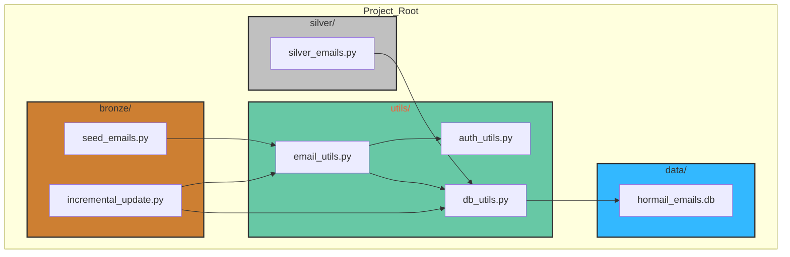
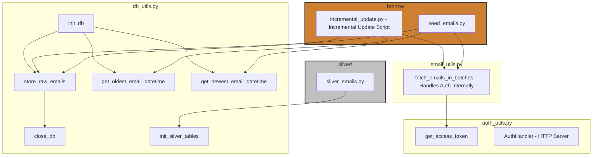

# Table of Contents
- [Table of Contents](#table-of-contents)
- [Approach for Email Classification and NER Extraction](#approach-for-email-classification-and-ner-extraction)
  - [Objective](#objective)
  - [**Bronze Layer**](#bronze-layer)
  - [**Silver Layer**](#silver-layer)
  - [**AI Enhancement**](#ai-enhancement)
  - [**Future Enhancements**](#future-enhancements)
- [System Architecture](#system-architecture)
- [Folder Structure](#folder-structure)
- [File System Architecture](#file-system-architecture)
- [Software Components Architecture](#software-components-architecture)

<br>
<hr>


# Approach for Email Classification and NER Extraction

## Objective
Develop a pipeline to classify emails (e.g., **donation-related**, **bill-related**) and extract **named entities** from email content (subject and body) for downstream AI/ML processing.

---

## **Bronze Layer**
- **Purpose**: Store raw emails fetched from the Microsoft Graph API.
- **Process**:
  - Emails are fetched using the Microsoft Graph API.
  - Raw data is stored in the `bronze_emails` SQLite table for durability and incremental processing.

---

## **Silver Layer**
- **Purpose**: Transform raw email data, perform NER, classify emails, and store enriched results.
- **Process**:
  1. **Transformations**:
     - Extract and clean **subject** and **body** (e.g., remove HTML tags using BeautifulSoup).
     - Perform **Named Entity Recognition (NER)** using SpaCy to extract entities like **ORG**, **MONEY**, **DATE**, etc.
     - Use a custom SpaCy **classification model** to classify emails as:
       - **Donation-related**
       - **Bill-related**
  2. **Storage**:
     - Store transformed data in the `silver_emails` SQLite table.
     - Schema includes:
       - **Metadata**: `email_id`, `subject`, `receivedDateTime`, etc.
       - **Extracted Entities**: `subject_entities`, `body_entities`.
       - **Classification Flags**: `donation_relevant`, `bill_relevant`.

---

## **AI Enhancement**
- **Fine-Tuning SpaCy**:
  1. **NER Fine-Tuning**:
     - Export emails from the **Bronze layer**.
     - Annotate entities (e.g., **DONATION**, **BILL**, **ORG**) using **Doccano**.
     - Train a custom SpaCy NER pipeline using the annotated data.
  2. **Classification Fine-Tuning**:
     - Use Doccano-annotated emails to train SpaCy’s `textcat` model for classification.

- **Integrated Pipeline**:
  - Incorporate fine-tuned NER and classification models into Silver layer processing.

---

## **Future Enhancements**
1. **Gold Layer**:
   - Aggregate data to generate actionable insights (e.g., donation summaries, tax reports).
   - En

</br>
</hr>

# System Architecture

```mermaid
graph TD;
    
    subgraph Application [Hotmail Assistant]
        style Application fill:#333333,stroke:#3ff,stroke-width:2px
        A1[Email Fetching & Processing] --> A2[Bronze Layer - Raw Emails Storage]
        A2 --> A3[Silver Layer - Transformed Emails Storage]
    end
    
    subgraph SQLite [SQLite Database]
        style SQLite fill:#A131C1,stroke:#333,stroke-width:2px
        DB1[bronze_emails - Raw Data] --> DB2[silver_emails - Transformed Data]
    end
    
    subgraph MicrosoftGraph [Microsoft Graph APIs]
        style MicrosoftGraph fill:#3333FF,stroke:#333,stroke-width:2px
        MG1[Authenticate with OAuth] --> MG2[Fetch Emails from Hotmail]
    end

    subgraph Hotmail [Hotmail Email Service]
        style Hotmail fill:#FFFACD,stroke:#333,stroke-width:2px
        H1[Hotmail Mailbox]
    end

    %% Interactions
    A1 --> MG1
    MG2 --> H1
    MG2 --> A1
    A2 --> DB1
    A3 --> DB2

```

<br><br>
<hr>


# Folder Structure
```
project-root/
│
├── bronze/
│   ├── seed_emails.py
│   ├── incremental_update.py
│
├── silver/
│   └── silver_emails.py
│
├── utils/
│   ├── auth_utils.py
│   ├── db_utils.py
│   ├── email_utils.py
│
├── data/
│   └── hotmail_emails.db (created by db_utils.py)


```

# File System Architecture


```mermaid
graph TD;
    
    subgraph Project_Root
        subgraph Bronze_Layer [bronze/]
            C1[seed_emails.py]
            C2[incremental_update.py]
        end
        style Bronze_Layer fill:#CD7F32,stroke:#333,stroke-width:2px
        
        subgraph Utils_Folder [utils/]
            A1[auth_utils.py]
            D1[db_utils.py]
            B1[email_utils.py]
        end
        style Utils_Folder fill:#67c8a5 ,stroke:#333,stroke-width:2px,color:#FF5733

        subgraph Data_Folder [data/]
            F1[hormail_emails.db]
        end
        style Data_Folder fill:#33b8ff ,stroke:#333,stroke-width:2px
        
        subgraph Silver_Layer [silver/]
            S1[silver_emails.py]
        end
        style Silver_Layer fill:#C0C0C0,stroke:#333,stroke-width:2px
    end
    
    C1 --> B1
    C2 --> B1
    C2 --> D1
    
    B1 --> A1
    B1 --> D1
    
    D1 --> F1

    S1 --> D1


```
<br><br>
<hr>

# Software Components Architecture


```mermaid
graph TD;
    
    subgraph Bronze_Layer [bronze/]
        C1[seed_emails.py]
        C2[incremental_update.py - Incremental Update Script]
    end
    style Silver_Layer fill:#C0C0C0,stroke:#333,stroke-width:2px

     subgraph Silver_Layer [silver/]
        S1[silver_emails.py]
        
    end
 style Bronze_Layer fill:#CD7F32,stroke:#333,stroke-width:2px
  
    subgraph DB_Module [db_utils.py]
        D1[init_db]
        D2[store_raw_emails]
        D3[get_oldest_email_datetime]
        D4[get_newest_email_datetime]
        D5[close_db]
        D6[init_silver_tables]
    end

    subgraph Email_Module [email_utils.py]
        B1[fetch_emails_in_batches - Handles Auth Internally]
    end

    subgraph Auth_Module [auth_utils.py]
        A1[get_access_token]
        A2[AuthHandler - HTTP Server]
    end
    

    
    C1 --> B1
    C1 --> D3  
    C1 --> D2
    
    C2 --> B1
    C2 --> D4  
    C2 --> D2
    
    B1 --> A1  
    
    D1 --> D2
    D1 --> D3
    D1 --> D4
    D2 --> D5

    S1 --> D6


```


